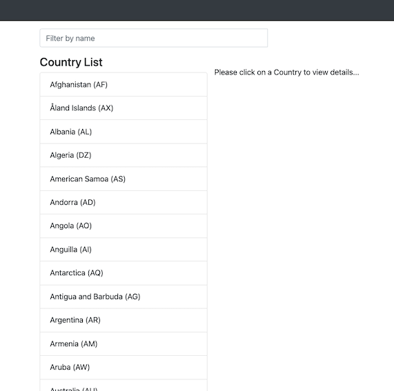
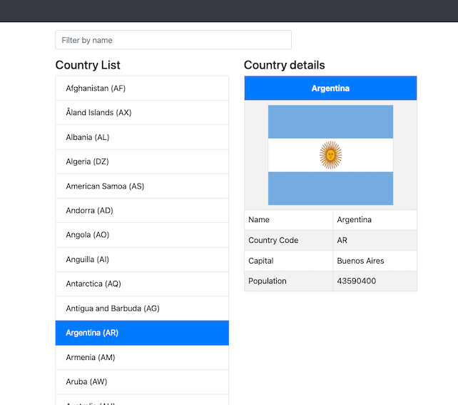
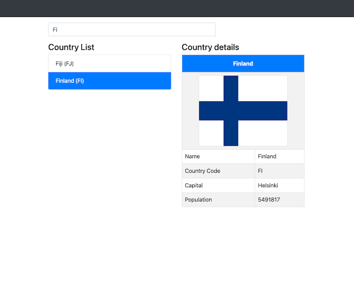

# Country Cloud Angular Frontend
This project provides a angular frontend sample application to consume the REST APIs exposed by the Country Cloud service hosted [here](https://github.com/vinoselv/country-cloud).

## What you will need
- [Angular >= 12.0.2](https://angular.io/)
- [Node >= 14.17.0](https://nodejs.org/en/)
- [Java 8](https://adoptopenjdk.net/?variant=openjdk8&jvmVariant=hotspot)

**Note:** I started from a sample project using the latest version of these components and so this project is not tested using the previous versions of these components.

## Build
- Run `npm install --save @angular-devkit/build-angular` to install the dependencies.
- Run `ng build` to build the project. The build artifacts will be stored in the `dist/` directory.

## Run and test
**Note:** You need to start the country cloud service to start using it from this service as explained [here](https://github.com/vinoselv/country-cloud#how-you-can-run) before running the web application.

Run `ng serve --port 8081` for a dev server. Navigate to `http://localhost:8081/countries` to load the home page.  

The page displays the list of all countries and the country code by default.

You can select the list of countries displayed in the list to view more specific details.

You can also use the input box to filter the countries based on the query string.

## Running unit tests
Run `ng test` to execute very basic unit tests via [Karma](https://karma-runner.github.io). 
